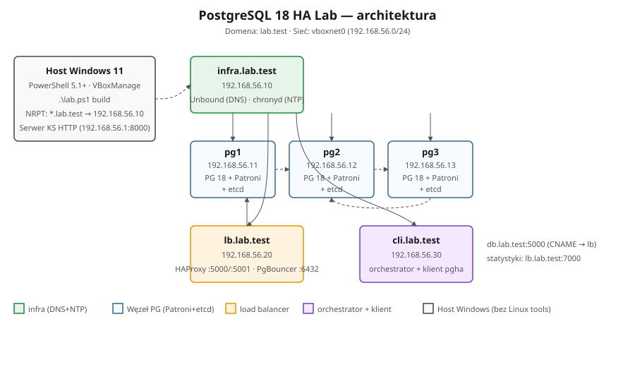

# 🐘 PostgreSQL 18 HA Lab

[]()
[]()
[]()
[]()
[]()
[]()
[]()
[]()

> 🎯 Reprodukowalne laboratorium **wysokiej dostępności** PostgreSQL 18 zbudowane na stosie
> **Patroni + etcd + HAProxy + PgBouncer** na guestach **Rocky Linux 9.8**, sterowane
> wyłącznie z hosta **Windows 11**, na którym zainstalowany jest tylko **VirtualBox**.
> Wersja angielska: [README.md](README.md).

🌐 **Wolisz wizualny przegląd?** Otwórz interaktywną stronę-wizytówkę (GitHub Pages) —
wizualny przegląd, diagramy architektury i wyniki przebiegów:
**[🇵🇱 wersja polska](https://krzysztof-i-cabaj.github.io/postgres18-ha-lab/index_PL.html)** ·
**[🇬🇧 English version](https://krzysztof-i-cabaj.github.io/postgres18-ha-lab/index.html)**.

---

## 🎯 Czym to jest?

To repozytorium buduje **prawdziwy klaster PostgreSQL na Twoim komputerze z Windows 11** —
sześć małych maszyn wirtualnych, które razem zachowują się jak produkcyjna baza danych,
która *działa dalej, gdy coś się psuje*. Jedno polecenie PowerShell buduje całość, inne ją
usuwa. Bez chmury, bez Ansible, bez WSL — **wystarczy VirtualBox**.

Gdy klaster działa, możesz go celowo **psuć** — zabić lidera bazy, wyłączyć VM, przeciąć
sieć, znokautować magazyn konsensusu — i obserwować, jak sam się leczy. Pomaga w tym
**13 gotowych scenariuszy testowych**, które automatycznie sprawdzają wynik (PASS/FAIL).

**Nie znasz PostgreSQL ani wysokiej dostępności?** Przeczytaj najpierw dwie kolejne sekcje —
tłumaczą ideę prostym językiem — a potem przejdź do [Szybkiego startu](#-szybki-start).

---

## 🛡️ Czym jest „wysoka dostępność” (HA)?

Pojedynczy serwer bazy to **pojedynczy punkt awarii**: gdy się zawiesi, zrestartuje albo
straci dysk, Twoja aplikacja przestaje działać. **Wysoka dostępność** usuwa ten pojedynczy
punkt, uruchamiając kilka kopii bazy i dodając automatykę, która — gdy aktywna kopia padnie —
**promuje inną kopię i przekierowuje do niej ruch — automatycznie, w kilka sekund, bez
udziału człowieka**.

Kilka pojęć używanych w tym labie, w prostych słowach:

- **Leader / primary** — jedyny węzeł, który aktualnie przyjmuje zapisy (`INSERT`/`UPDATE`).
- **Replika / standby** — węzeł, który na bieżąco kopiuje dane lidera i może go zastąpić.
  Repliki mogą też obsługiwać zapytania tylko do odczytu.
- **Failover** — automatyczne przełączenie: replika staje się nowym liderem po śmierci starego.
- **Replikacja synchroniczna** — lider czeka, aż replika potwierdzi każdy commit, więc
  zatwierdzony wiersz na pewno przetrwa failover (**zero utraty danych**).
- **Kworum** — głosowanie większością (tu 2 z 3), które decyduje, kto jest liderem, i
  zapobiega sytuacji, w której dwa węzły uważają się za lidera naraz („split-brain”).

---

## 🧠 Jak HA działa w tym labie (koncepcja)



Lab uruchamia **trzy węzły PostgreSQL** (jeden lider, dwie repliki) plus zaplecze, które
sprawia, że failover jest automatyczny:

1. **Patroni** działa obok PostgreSQL na każdym węźle i bez przerwy odnawia dzierżawę
   („jestem liderem”).
2. **etcd** przechowuje tę dzierżawę — to wspólne źródło prawdy klastra o tym, *kto jest
   liderem w danej chwili*.
3. Gdy lider padnie, jego dzierżawa wygasa (~30 s). Pozostałe węzły głosują przez etcd;
   zwycięzca zostaje **promowany** na lidera przez Patroni.
4. **HAProxy** stale pyta Patroni „kto jest liderem?” i **przekierowuje zapisy klientów** do
   aktualnego lidera — aplikacje cały czas używają jednego stabilnego adresu
   (`db.lab.test:5000`).
5. Ponieważ replikacja jest **synchroniczna**, wiersz zatwierdzony przez aplikację chwilę
   przed awarią jest nadal obecny na nowym liderze.

Stary lider po restarcie dołącza jako replika (używając `pg_rewind`, jeśli jego historia się
rozjechała). Pełny opis z diagramami: **[docs/ARCHITECTURE_PL.md](docs/ARCHITECTURE_PL.md)**
· samodzielna strona z diagramami: **[architecture.html](https://krzysztof-i-cabaj.github.io/postgres18-ha-lab/architecture.html)**.

---

## 🧩 Części składowe (po ludzku)

| Komponent | Za co odpowiada | Działa na |
|---|---|---|
| 🐘 **PostgreSQL 18** | Sama baza; trójwęzłowy klaster z replikacją strumieniową, baza `labdb`. | pg1 · pg2 · pg3 |
| 🧭 **Patroni 4.1** | Nadzorca HA — wybiera lidera, promuje replikę przy awarii, dołącza stare lidery. | pg1 · pg2 · pg3 |
| 🗳️ **etcd 3.5** | Rozproszony „mózg” — przechowuje dzierżawę lidera i stan klastra; kworum 2 z 3. | pg1 · pg2 · pg3 |
| 🔀 **HAProxy 2.8** | Kieruje zapisy (`:5000`) do lidera, odczyty (`:5001`) do replik; przełącza przy failoverze. | lb |
| 🪣 **PgBouncer 1.23** | Pula połączeń przed HAProxy — utrzymuje niski narzut pod obciążeniem. | lb |
| 🌐 **Unbound DNS** | Rozwiązuje nazwy labu `lab.test`, w tym stabilny endpoint `db.lab.test`. | infra |
| ⏱️ **chronyd NTP** | Synchronizuje zegary węzłów — ważne dla niezawodnego konsensusu. | infra |
| 🐕 **softdog watchdog** | Zabezpieczenie jądra: restartuje zawieszonego lidera, by nie trzymał dzierżawy w nieskończoność. | pg1 · pg2 · pg3 |
| 🐍 **pgha-client** | Pythonowy klient testowy (writer/reader/monitor), mierzy realny downtime aplikacji podczas failoveru. | cli |

---

## 🖥️ Co dostajesz

- **6 maszyn wirtualnych** w prywatnej sieci host-only `192.168.56.0/24` (bez dostępu do internetu):
  - `infra` — rekursywny DNS (Unbound) + NTP (chronyd)
  - `pg1`, `pg2`, `pg3` — 3-węzłowy klaster Patroni/etcd/PostgreSQL (synchroniczny + watchdog)
  - `lb` — HAProxy + PgBouncer (stabilny endpoint klienta `db.lab.test`)
  - `cli` — orchestrator + pythonowy klient testowy
- **13 zeskryptowanych scenariuszy awarii** z automatycznymi asercjami PASS/FAIL
- **Statyczna strona GitHub Pages** (`docs/`) z diagramami i interaktywnymi raportami przebiegu

---

## 🚀 Szybki start

```powershell
# zwykły (nie podniesiony) PowerShell
.\lab.ps1 prereqs        # weryfikacja wymagań hosta + ssh-keygen jeśli brak klucza
.\lab.ps1 build          # zbuduj całe laboratorium (~30 min na Ryzen 9 + NVMe)
.\lab.ps1 status         # pokaż stan klastra i otwórz HAProxy stats w przeglądarce

# jednorazowo, wymaga PowerShella jako Administrator:
.\lab.ps1 dns install    # dodaje regułę NRPT, *.lab.test rozwiązuje się na Windows
```

Po `lab.ps1 dns install`:

```powershell
ssh root@pg1.lab.test 'patronictl -c /etc/patroni/patroni.yml list'
psql "host=db.lab.test port=5000 dbname=labdb user=lab password=lab"
```

Runbook komenda-po-komendzie z pułapkami: **[docs/QUICKSTART_PL.md](docs/QUICKSTART_PL.md)** ·
pełny walkthrough Windows 11: **[docs/SETUP_PL.md](docs/SETUP_PL.md)**.

---

## 📋 Wymagania hosta

- **Windows 11 Pro** x64 z **VirtualBox 7.0+** (dostarcza `VBoxManage.exe`)
- Wbudowane narzędzia: PowerShell 5.1+, klient OpenSSH, `curl.exe`
- **Python 3.8+** na hoście (uruchamia mały serwer HTTP kickstart `host/ks_server.py`)
- **Nieużywane na hoście**: Ansible, WSL, Make, Chocolatey, Scoop
- ≥ 20 GB wolnego RAM, ≥ 60 GB wolnego dysku

Cała warstwa klastra żyje **wewnątrz VMek**. Host uruchamia tylko VirtualBox + mały serwer
kickstart w Pythonie.

---

## 🧪 Scenariusze testowe

Trzynaście zeskryptowanych trybów awarii, uruchamianych pojedynczo (`lab.ps1 scenario NN`)
albo całą serią:

| #  | Scenariusz                | Co udowadnia                                                  |
|----|---------------------------|--------------------------------------------------------------|
| 01 | `baseline`                | Sanity klastra — `patronictl list`, zdrowie etcd             |
| 02 | `kill-primary-hard`       | `pkill -9 postgres` na liderze, weryfikacja zerowej utraty   |
| 03 | `poweroff-primary-vm`     | `VBoxManage controlvm <pri> poweroff` → failover → restart   |
| 04 | `graceful-switchover`     | Planowany `patronictl switchover`, bez utraty danych         |
| 05 | `network-partition`       | `iptables DROP` izoluje lidera → failover, samoleczenie      |
| 06 | `etcd-single-loss`        | Stop etcd na jednym węźle — kworum 2/3 trzyma                 |
| 07 | `etcd-quorum-loss`        | Stop etcd na dwóch węzłach — obserwacja failsafe, potem recovery |
| 08 | `replica-restart`         | `systemctl restart patroni` na replice — lider bez zmian     |
| 09 | `pg-rewind-old-primary`   | Stary primary dołącza przez `pg_rewind` po rozjeździe timeline |
| 10 | `sync-vs-async`           | Przełączenie `synchronous_mode`, demo trade-offu trwałości   |
| 11 | `multi-host-libpq`        | Failover bez sterownika, przez libpq `target_session_attrs`  |
| 12 | `cascading-failure`       | Zabij lidera, potem nowego lidera — wybierany jest trzeci     |
| 13 | `app-failover-continuous` | Obciążenie `pgha-client` przez zabicie lidera — mierzy downtime aplikacji |

```powershell
.\lab.ps1 scenario 02
.\lab.ps1 scenario all
.\lab.ps1 report          # zbuduj docs/run-report_PL.html z logów przebiegu + metryk
```

Szczegóły scenariuszy i oczekiwany output: **[docs/SCENARIOS_PL.md](docs/SCENARIOS_PL.md)**.

---

## 📚 Kluczowe dokumenty i strony

- 🏠 **Strona-wizytówka projektu (GitHub Pages):** [index_PL.html](https://krzysztof-i-cabaj.github.io/postgres18-ha-lab/index_PL.html) (PL) ·
  [index.html](https://krzysztof-i-cabaj.github.io/postgres18-ha-lab/index.html) (EN) — wizualny przegląd, architektura, wyniki.
- 🏛️ [docs/ARCHITECTURE_PL.md](docs/ARCHITECTURE_PL.md) — komponenty, sekwencja failover, infrastruktura DNS/NTP
- 🚀 [docs/QUICKSTART_PL.md](docs/QUICKSTART_PL.md) — złóż i wystartuj LAB (komenda-po-komendzie + pułapki)
- ⚙️ [docs/SETUP_PL.md](docs/SETUP_PL.md) — pełny walkthrough Windows 11 wraz z NRPT DNS
- 🧪 [docs/SCENARIOS_PL.md](docs/SCENARIOS_PL.md) — 13 scenariuszy z oczekiwanym outputem
- 🛠️ [docs/MANUAL_INSTALL_PL.md](docs/MANUAL_INSTALL_PL.md) — budowa labu ręcznie, węzeł po węźle (bez `lab.ps1`)
- 🚧 [docs/TROUBLESHOOTING_PL.md](docs/TROUBLESHOOTING_PL.md) — VBox/scancode, fallback NRPT, watchdog
- 📊 **Raporty przebiegu (GitHub Pages):** [agentic-run-all_PL.html](https://krzysztof-i-cabaj.github.io/postgres18-ha-lab/agentic-run-all_PL.html) (pełna suita 13/13)
  · [run-report_PL.html](https://krzysztof-i-cabaj.github.io/postgres18-ha-lab/run-report_PL.html) (ostatni przebieg) — wersja EN: pliki bez `_PL`
- 📃 [docs/AGENTIC_RUN_ALL_PL.md](docs/AGENTIC_RUN_ALL_PL.md) / [docs/RUN_REPORT_PL.md](docs/RUN_REPORT_PL.md) — te same raporty jako Markdown
- 📘 [docs/README_PL.md](docs/README_PL.md) — pełny indeks dokumentacji (wszystkie pary EN/PL)
- 🔧 [report/README_PL.md](report/README_PL.md) — generator raportu (`lab.ps1 report`)
- ⚙️ [SETTINGS_PL.md](SETTINGS_PL.md) — wartości specyficzne projektu (ścieżka `<repo>`, mapa VMek, sekrety, SSH)

---

## 📄 Licencja

[MIT](LICENSE) © 2026 KCB Kris
