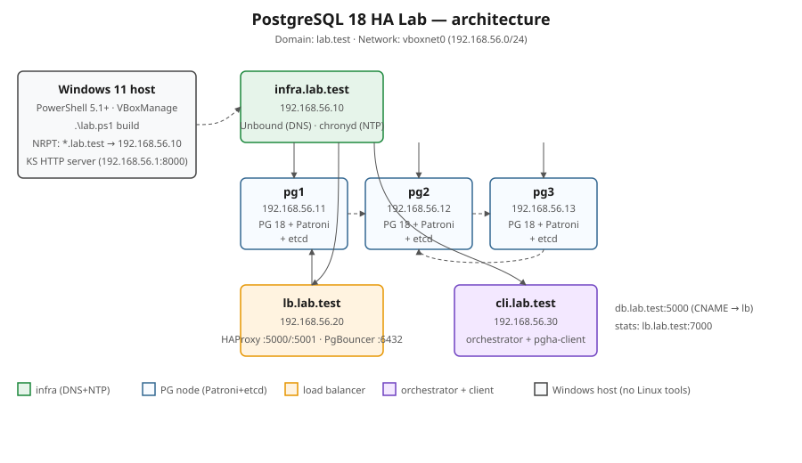
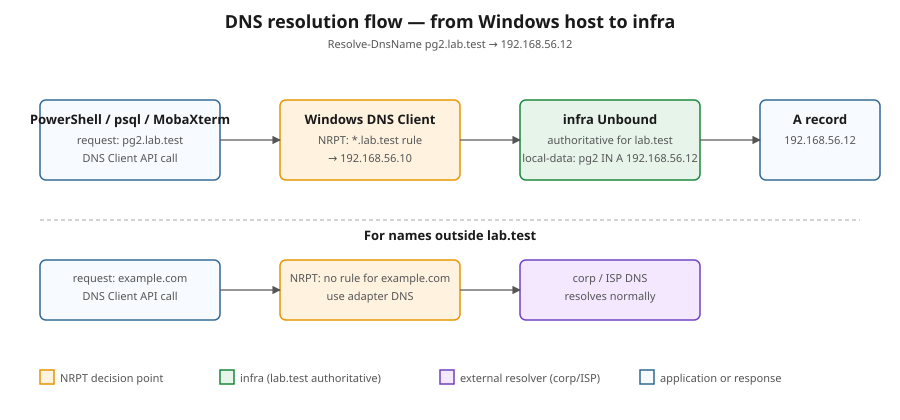
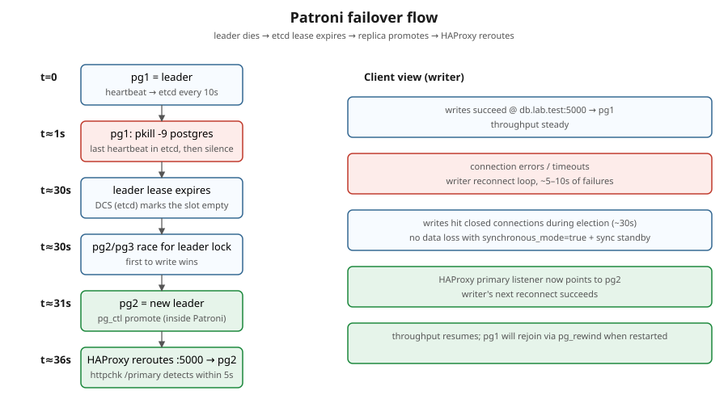

# 🏛️ Architecture

[]()
[]()

> 🎯 Components, network layout, failover sequence, lab infrastructure (DNS+NTP).
> Polish: [ARCHITECTURE_PL.md](ARCHITECTURE_PL.md).



## Components

| VM | IP | Role | Software |
|---|---|---|---|
| infra.lab.test | 192.168.56.10 | DNS + NTP | Unbound, chronyd |
| pg1.lab.test | 192.168.56.11 | DB node | PostgreSQL 18, Patroni 4.1, etcd 3.5 |
| pg2.lab.test | 192.168.56.12 | DB node | PostgreSQL 18, Patroni 4.1, etcd 3.5 |
| pg3.lab.test | 192.168.56.13 | DB node | PostgreSQL 18, Patroni 4.1, etcd 3.5 |
| lb.lab.test | 192.168.56.20 | Load balancer | HAProxy 2.8, PgBouncer 1.23 |
| cli.lab.test | 192.168.56.30 | Orchestrator + client | Python 3.11, pgha-client |

## Lab infrastructure services

`infra` is the **first** VM to boot. Other VMs cannot complete `00-common.sh`
without DNS available. Boot sequence is therefore:

```
infra (kickstart + 05-infra.sh) ─────► DNS + NTP serving
       │
       ├─► pg1 (kickstart + 00-common.sh + 10-etcd + 20-pg + 30-patroni)
       ├─► pg2 (same)
       ├─► pg3 (same)
       ├─► lb  (kickstart + 00-common + 40-haproxy + 50-pgbouncer)
       └─► cli (kickstart + 00-common + 60-client + run orchestrate.sh)
```

### DNS

Unbound on `infra.lab.test` is **authoritative** for `lab.test` and
**recursive** for everything else (forwarders 1.1.1.1 / 9.9.9.9 / 8.8.8.8).
Stable client endpoint: `db.lab.test` is a CNAME to `lb.lab.test`.



### NTP

`chronyd` on infra peers with public NTP and serves the `192.168.56.0/24` lab.
Other VMs run chronyd as a **client** of infra (`server 192.168.56.10 iburst prefer`).

### Why `lab.test` not `lab.local`

`.local` is reserved for **mDNS (RFC 6762)**. Windows and avahi-daemon treat
queries to `*.local` specially, often adding 5-second timeouts. **`.test` is
reserved by RFC 6761** explicitly for testing/labs and never collides with
real DNS.

## Failover sequence



1. Patroni leader writes regular heartbeats into etcd (TTL 30s, loop_wait 10s)
2. Primary dies (kill, partition, poweroff)
3. After ~30s, leader lock expires in etcd
4. Patroni replicas race to acquire the lock; one wins -> new leader
5. New leader promotes (`pg_ctl promote` semantics inside Patroni)
6. HAProxy `option httpchk GET /primary` notices the change at next interval (5s)
7. Writes resume through `db.lab.test:5000` (HAProxy primary listener)
8. The fallen primary, when restarted, joins as replica via `pg_rewind` if needed

## Watchdog

PG nodes load `softdog` kernel module (no real hardware in VBox). Patroni's
`watchdog.mode: automatic` opens `/dev/watchdog` and uses it as a fence — if
the leader stalls for too long, the kernel itself reboots the node, releasing
the etcd lock immediately. Fallback: `WATCHDOG_MODE=off` in `lab.config.psd1`
if your Rocky kernel refuses softdog.
