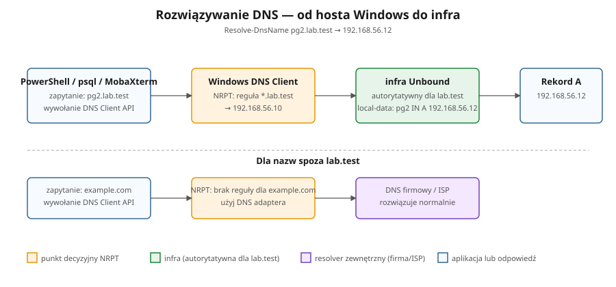
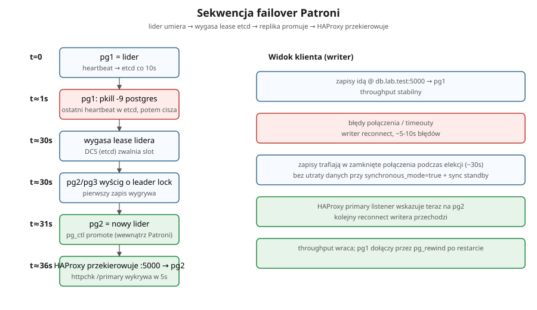

# 🏛️ Architektura

[]()
[]()

> 🎯 Komponenty, układ sieci, sekwencja failover, infrastruktura labu (DNS+NTP).
> Wersja angielska: [ARCHITECTURE.md](ARCHITECTURE.md).


## Komponenty

| VM | IP | Rola | Oprogramowanie |
|---|---|---|---|
| infra.lab.test | 192.168.56.10 | DNS + NTP | Unbound, chronyd |
| pg1.lab.test | 192.168.56.11 | Węzeł DB | PostgreSQL 18, Patroni 4.1, etcd 3.5 |
| pg2.lab.test | 192.168.56.12 | Węzeł DB | PostgreSQL 18, Patroni 4.1, etcd 3.5 |
| pg3.lab.test | 192.168.56.13 | Węzeł DB | PostgreSQL 18, Patroni 4.1, etcd 3.5 |
| lb.lab.test | 192.168.56.20 | Load balancer | HAProxy 2.8, PgBouncer 1.23 |
| cli.lab.test | 192.168.56.30 | Orchestrator + klient | Python 3.11, pgha-client |

## Usługi infrastrukturalne labu

`infra` to **pierwsza** uruchamiana VMka. Pozostałe nie skończą `00-common.sh`
bez działającego DNS. Sekwencja bootu:

```
infra (kickstart + 05-infra.sh) ─────► DNS + NTP serwuja
       │
       ├─► pg1 (kickstart + 00-common.sh + 10-etcd + 20-pg + 30-patroni)
       ├─► pg2 (to samo)
       ├─► pg3 (to samo)
       ├─► lb  (kickstart + 00-common + 40-haproxy + 50-pgbouncer)
       └─► cli (kickstart + 00-common + 60-client + run orchestrate.sh)
```

### DNS

Unbound na `infra.lab.test` jest **autorytatywny** dla `lab.test` i
**rekursywny** dla wszystkiego innego (forwardery 1.1.1.1 / 9.9.9.9 / 8.8.8.8).
Stabilny endpoint klienta: `db.lab.test` to CNAME na `lb.lab.test`.



### NTP

`chronyd` na infra peeruje z publicznym NTP i serwuje sieć `192.168.56.0/24`.
Pozostałe VMki uruchamiają chronyd jako **klienta** infry
(`server 192.168.56.10 iburst prefer`).

### Dlaczego `lab.test` a nie `lab.local`

`.local` jest zarezerwowane dla **mDNS (RFC 6762)**. Windows i avahi-daemon
traktują zapytania do `*.local` specjalnie, często dodając 5-sekundowe timeouty.
**`.test` jest zarezerwowane przez RFC 6761** wyraźnie do celów testowych
i nigdy nie koliduje z prawdziwym DNS.

## Sekwencja failover



1. Lider Patroni regularnie wpisuje heartbeaty do etcd (TTL 30s, loop_wait 10s)
2. Primary umiera (kill, partycja, poweroff)
3. Po ~30s leader lock wygasa w etcd
4. Repliki Patroni ścigają się o lock; jedna wygrywa -> nowy lider
5. Nowy lider promuje się (`pg_ctl promote` w semantyce Patroni)
6. HAProxy `option httpchk GET /primary` zauważa zmianę przy następnym interwale (5s)
7. Zapisy wracają przez `db.lab.test:5000` (HAProxy primary listener)
8. Stary primary, po restarcie, dołącza jako replika — w razie potrzeby przez `pg_rewind`

## Watchdog

PG nodes ładują moduł kernela `softdog` (brak prawdziwego HW w VBox). Patroni
z `watchdog.mode: automatic` otwiera `/dev/watchdog` i używa go jako fence —
jeśli lider zacina się zbyt długo, kernel sam restartuje węzeł, od razu zwalniając
lock w etcd. Fallback: `WATCHDOG_MODE=off` w `lab.config.psd1` jeśli kernel Rocky
odmówi załadowania softdog.
